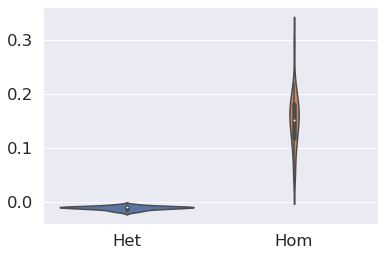
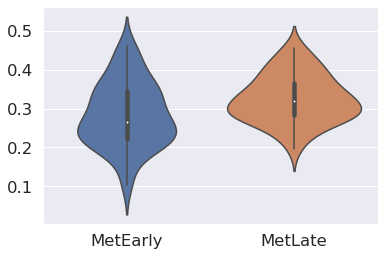

# SHscore validation on simulated data

## SHscore statistics
Here you find the code you need to compute the statistics on SHscores computed on simulated datasets. 
SHscores have been precomputed because the computation, here, would take too much time. 

You may refer to the other notebooks in the current repository or to the documentation at the official [PhyliCS repository](https://github.com/bioinformatics-polito/PhyliCS) to learn how to compute the SHscore.


### Experiment1: spatial segregation and intermixing


```python
import os
import pandas as pd 
from math import nan 
import numpy as np
import matplotlib.pyplot as plt 
import seaborn as sns
from scipy.stats import mannwhitneyu

SPATIAL_DIR = "data/simulations/spatial"

samples=os.listdir(SPATIAL_DIR)

# collect spatial simulation scores (already computed)
sh_scores = pd.DataFrame(columns=["Het", "Hom"]) 
for sample in samples:
    sample_path = os.path.join(SPATIAL_DIR, sample)
    if os.path.isdir(sample_path):
        het_score = nan 
        hom_score = nan
        f = os.path.join(sample_path, "hom", "heterogeneity_scores.csv")
        hom_score = pd.read_csv(f, sep = "\t").iloc[0]["het_score"].astype(float)
        f = os.path.join(sample_path, "het", "heterogeneity_scores.csv")
        het_score = pd.read_csv(f, sep = "\t").iloc[0]["het_score"].astype(float)
        sh_scores = sh_scores.append({"Het":het_score, "Hom":hom_score}, ignore_index=True)
 
sh_scores.head()

```


<div>
<style scoped>
    .dataframe tbody tr th:only-of-type {
        vertical-align: middle;
    }

    .dataframe tbody tr th {
        vertical-align: top;
    }

    .dataframe thead th {
        text-align: right;
    }
</style>
<table border="1" class="dataframe">
  <thead>
    <tr style="text-align: right;">
      <th></th>
      <th>Het</th>
      <th>Hom</th>
    </tr>
  </thead>
  <tbody>
    <tr>
      <th>0</th>
      <td>-0.010599</td>
      <td>0.152150</td>
    </tr>
    <tr>
      <th>1</th>
      <td>-0.004221</td>
      <td>0.122702</td>
    </tr>
    <tr>
      <th>2</th>
      <td>-0.020251</td>
      <td>0.101908</td>
    </tr>
    <tr>
      <th>3</th>
      <td>-0.014684</td>
      <td>0.220385</td>
    </tr>
    <tr>
      <th>4</th>
      <td>-0.007606</td>
      <td>0.209253</td>
    </tr>
  </tbody>
</table>
</div>


```python
stat, p1 =  mannwhitneyu(sh_scores['Het'].dropna(), sh_scores['Hom'].dropna())
print("Mann-whitney-u: " + str(p1))
```

    Mann-whitney-u: 3.533035965194466e-18


```python
sns.set(font_scale=1.5)
sns.violinplot(data=sh_scores)
plt.savefig(os.path.join(SPATIAL_DIR, "aggregate_het_scores_violin_spatial.png"))
```





```python
sh_scores.describe()
```


<div>
<style scoped>
    .dataframe tbody tr th:only-of-type {
        vertical-align: middle;
    }

    .dataframe tbody tr th {
        vertical-align: top;
    }

    .dataframe thead th {
        text-align: right;
    }
</style>
<table border="1" class="dataframe">
  <thead>
    <tr style="text-align: right;">
      <th></th>
      <th>Het</th>
      <th>Hom</th>
    </tr>
  </thead>
  <tbody>
    <tr>
      <th>count</th>
      <td>50.000000</td>
      <td>50.000000</td>
    </tr>
    <tr>
      <th>mean</th>
      <td>-0.011163</td>
      <td>0.152459</td>
    </tr>
    <tr>
      <th>std</th>
      <td>0.003506</td>
      <td>0.051984</td>
    </tr>
    <tr>
      <th>min</th>
      <td>-0.020251</td>
      <td>0.043447</td>
    </tr>
    <tr>
      <th>25%</th>
      <td>-0.013067</td>
      <td>0.117336</td>
    </tr>
    <tr>
      <th>50%</th>
      <td>-0.010597</td>
      <td>0.151503</td>
    </tr>
    <tr>
      <th>75%</th>
      <td>-0.009084</td>
      <td>0.181446</td>
    </tr>
    <tr>
      <th>max</th>
      <td>-0.004221</td>
      <td>0.294926</td>
    </tr>
  </tbody>
</table>
</div>


```python
third_quart = sh_scores.quantile(0.75)
first_quart = sh_scores.quantile(0.25)
IQR = third_quart - first_quart
print("IQR")
IQR
```

    IQR

    Het    0.003983
    Hom    0.064110
    dtype: float64


### Experiment2: early and late metastasis spreading


```python
MET_DIR = "data/simulations/metastasis"
EXPS = ["MetEarly", "MetLate"]

#samples=os.listdir(MET_DIR)

# collect metastasis simulation scores (already computed)
sh_scores = pd.DataFrame() 
for exp in EXPS:
    col = []
    prefix = os.path.join(MET_DIR, exp)
    for sample in samples:
        sample_path = os.path.join(prefix, sample)
        if os.path.isdir(sample_path):
            f = os.path.join(sample_path, "heterogeneity_scores.csv")
            sh_score = pd.read_csv(f, sep = "\t")["het_score"].astype(float).values[0]
            col.append(sh_score)
    sh_scores[exp] = col
 
sh_scores.head()
```


<div>
<style scoped>
    .dataframe tbody tr th:only-of-type {
        vertical-align: middle;
    }

    .dataframe tbody tr th {
        vertical-align: top;
    }

    .dataframe thead th {
        text-align: right;
    }
</style>
<table border="1" class="dataframe">
  <thead>
    <tr style="text-align: right;">
      <th></th>
      <th>MetEarly</th>
      <th>MetLate</th>
    </tr>
  </thead>
  <tbody>
    <tr>
      <th>0</th>
      <td>0.246488</td>
      <td>0.248649</td>
    </tr>
    <tr>
      <th>1</th>
      <td>0.214796</td>
      <td>0.285811</td>
    </tr>
    <tr>
      <th>2</th>
      <td>0.219802</td>
      <td>0.283999</td>
    </tr>
    <tr>
      <th>3</th>
      <td>0.279430</td>
      <td>0.373420</td>
    </tr>
    <tr>
      <th>4</th>
      <td>0.384243</td>
      <td>0.275313</td>
    </tr>
  </tbody>
</table>
</div>


```python
stat, p1 =  mannwhitneyu(sh_scores['MetEarly'].dropna(), sh_scores['MetLate'].dropna())
print("Mann-whitney-u: " + str(p1))
```

    Mann-whitney-u: 0.002942859612686273


```python
sns.set(font_scale=1.5)
sns.violinplot(data=sh_scores)
plt.savefig(os.path.join(SPATIAL_DIR, "aggregate_het_scores_violin_met.png"))
```





```python
sh_scores.describe()
```


<div>
<style scoped>
    .dataframe tbody tr th:only-of-type {
        vertical-align: middle;
    }

    .dataframe tbody tr th {
        vertical-align: top;
    }

    .dataframe thead th {
        text-align: right;
    }
</style>
<table border="1" class="dataframe">
  <thead>
    <tr style="text-align: right;">
      <th></th>
      <th>MetEarly</th>
      <th>MetLate</th>
    </tr>
  </thead>
  <tbody>
    <tr>
      <th>count</th>
      <td>50.000000</td>
      <td>50.000000</td>
    </tr>
    <tr>
      <th>mean</th>
      <td>0.284679</td>
      <td>0.325422</td>
    </tr>
    <tr>
      <th>std</th>
      <td>0.082631</td>
      <td>0.060854</td>
    </tr>
    <tr>
      <th>min</th>
      <td>0.103382</td>
      <td>0.195173</td>
    </tr>
    <tr>
      <th>25%</th>
      <td>0.221824</td>
      <td>0.282963</td>
    </tr>
    <tr>
      <th>50%</th>
      <td>0.266158</td>
      <td>0.319743</td>
    </tr>
    <tr>
      <th>75%</th>
      <td>0.345860</td>
      <td>0.366470</td>
    </tr>
    <tr>
      <th>max</th>
      <td>0.460590</td>
      <td>0.456582</td>
    </tr>
  </tbody>
</table>
</div>


```python
third_quart = sh_scores.quantile(0.75)
first_quart = sh_scores.quantile(0.25)
IQR = third_quart - first_quart
print("IQR")
IQR
```

    IQR

    MetEarly    0.124036
    MetLate     0.083507
    dtype: float64


```python

```
