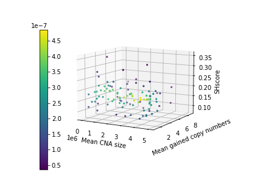

# SHscore and CN structural features

Here you can find the code to reproduce the results shown in the section **Experiment 1: SHscore on synthetic data**, subsection **SHscore indipendence from CNA size and gained copy number** of the paper. SHscores distances have been precomputed because the computation, here, would take too much time.

You may refer to the other notebooks in the current repository or to the documentation at the official [PhyliCS repository](https://github.com/bioinformatics-polito/PhyliCS) to learn how to compute the SHscore.


```python
import os, sys
import argparse
import pandas as pd
import matplotlib.pyplot as plt
import seaborn as sns 
from scipy.stats import pearsonr, gaussian_kde
from mpl_toolkits.mplot3d import Axes3D
import numpy as np

DATA_DIR = "data/simulations/multiple_sizes"

def compute_correlations_and_plot3D(shscores, thetas, rec_ps, outpath):
    c1, p1 = pearsonr(shscores, thetas)
    print("Pearson correlation (mean CNA size): c = {}, p={}".format(c1, p1))
    
    c2, p2 = pearsonr(shscores, rec_ps)
    print("Pearson correlation (mean gained copies): c = {}, p={}".format(c2, p2))
    
    x = thetas
    y = rec_ps
    z = shscores
    fig = plt.figure()
    ax = fig.add_subplot(projection='3d')
    xyz = np.vstack([x,y,z])
    k = gaussian_kde(xyz)(xyz)
    plot = ax.scatter(x, y, z, c=k, s=5)
    #rotate xy plane
    ax.azim = -60
    ax.dist = 10
    ax.elev = 10
    ax.set_xlabel("Mean CNA size", linespacing=3.2)
    ax.set_ylabel("Mean gained copy numbers", linespacing=3.2)
    ax.set_zlabel("SHscore", linespacing=3.2)
    cax = fig.add_axes([0.15, 0.03, 0.03, 0.80])
    fig.colorbar(plot, cax=cax)
    plt.savefig(os.path.join(outpath, "shscores_pearson.png"))
    plt.close("all")
    
table = pd.read_csv(os.path.join(DATA_DIR, "shscores.tsv"), sep="\t")
compute_correlations_and_plot3D(table.sh_score.values, table.theta.values, table["1/p"].values, DATA_DIR)
```

    Pearson correlation (mean CNA size): c = -0.10056726730324786, p=0.3194661381807022
    Pearson correlation (mean gained copies): c = -0.10855902612931499, p=0.2823197478581353




