# MDA-MB-231 Cell libe analysis

Here you find the code to reproduce the analysis on the MDA-MB-231 cell line and on the two daughter cell lines, MDA-MB-231-EX1 and MDA-MB-231-EX2, obtained from the clonal expansion of two cells. Here we present only PhyliCS application, while you can find the pipeline to download and allign the sequencing reads and to call the scCNA events at [Snakefile](https://github.com/bioinformatics-polito/PhyliCS_usage/blob/main/snakemake/Snakefile_mdamb231_cellline). We remind, once again, data MDA-MB-231 processed data can't be deposited at this repository due to IRB protocol. Raw datasets are deposited under BioProject PRJNA629885.

## Experiment 1: Multi-sample analysis on the three cell lines

### Data Prepocessing


```python
import os
import phylics
import pandas as pd

DATA_DIR = "data/mdamb231/data"
FIGURES_DIR = "data/mdamb231/figures"

# Load EX1 data and plot some dataset features
ex1 = phylics.Sample.from_file(os.path.join(DATA_DIR, "EX1/SegCopy"), sample_name="ex1")
df = pd.read_csv(os.path.join(DATA_DIR, "EX1/results.txt"), sep="\t", index_col=0).dropna()
ploidy = df['Copy_Number']
ex1.add_annotation(ploidy, "mean_cn")
ex1.plot_annotation_dist("mean_cn", kind="kde", figsize=(7,7), outpath= os.path.join(FIGURES_DIR, "ex1_ploidy.png"))
```

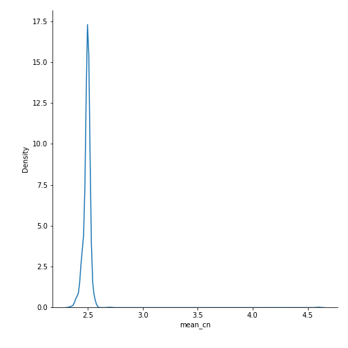


```python
ex1.mad()
ex1.plot_annotation_dist("mad", kind="kde", figsize=(7,7), outpath=os.path.join(FIGURES_DIR, "ex1_mad.png"))
```

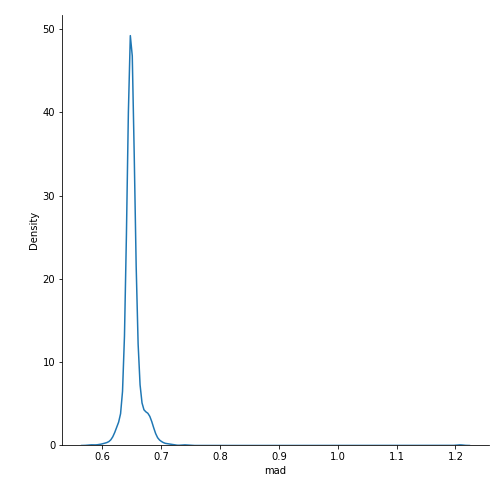


```python
# Load EX2 data and plot some dataset features
ex2 = phylics.Sample.from_file(os.path.join(DATA_DIR, "EX2/SegCopy"), sample_name="ex2")
df = pd.read_csv(os.path.join(DATA_DIR, "EX2/results.txt"), sep="\t", index_col=0).dropna()
ploidy = df['Copy_Number']
ex2.add_annotation(ploidy, "mean_cn")
ex2.plot_annotation_dist("mean_cn", kind="kde", figsize=(7,7), outpath= os.path.join(FIGURES_DIR, "ex2_ploidy.png"))
```

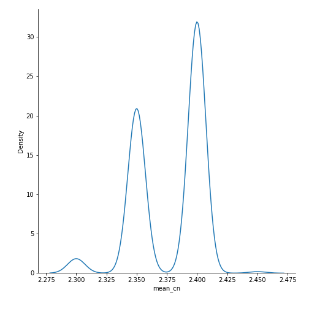


```python
ex2.mad()
ex2.plot_annotation_dist("mad", kind="kde", figsize=(7,7), outpath=os.path.join(FIGURES_DIR, "ex2_mad.png"))
```

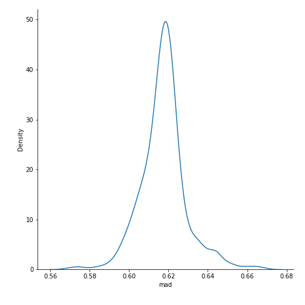


```python
# Load parental data and plot some dataset features
p = phylics.Sample.from_file(os.path.join(DATA_DIR, "Parental/SegCopy"), sample_name="p")
df = pd.read_csv(os.path.join(DATA_DIR, "Parental/results.txt"), sep="\t", index_col=0).dropna()
ploidy = df['Copy_Number']
p.add_annotation(ploidy, "mean_cn")
p.plot_annotation_dist("mean_cn", kind="kde", figsize=(7,7), outpath= os.path.join(FIGURES_DIR, "p_ploidy.png"))
```

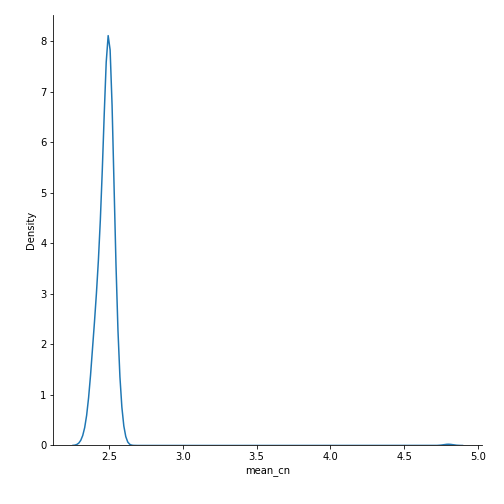


```python
p.mad()
p.plot_annotation_dist("mad", kind="kde", figsize=(7,7), outpath=os.path.join(FIGURES_DIR, "p_mad.png"))
```

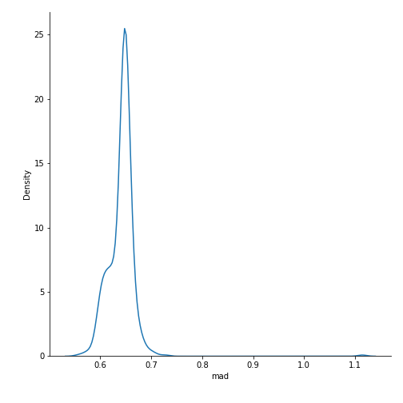

### Multi-sample analysis


```python
ss = phylics.MultiSample.from_list(ex1, ex2, p)
ss.SHscores(n_jobs=10)
ss.plot_SHscores(outpath=os.path.join(FIGURES_DIR, "sh_scores.png"))
```


```python
ss.plot_dendrogram(outpath=os.path.join(FIGURES_DIR, "multi_sample_heatmap.png"))
```

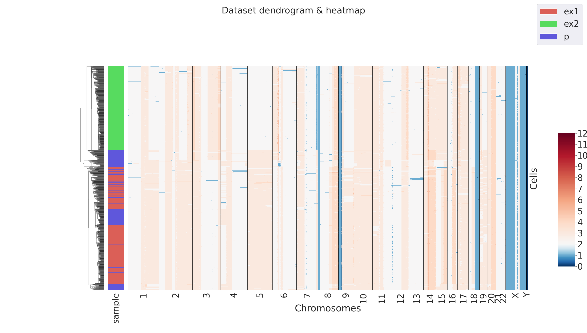

## Experiment 2: Parental cell line clustering


```python
p.count() # original number of cells
```


    508


```python
# Filter cells which MAD > 0.8 (noisy)
p = p.filter("mad", "lt_eq", 0.8)
p.count()
```


    507


```python
p.umap()
p.plot_umap(outpath=os.path.join(FIGURES_DIR, "p_umap.png"))
```

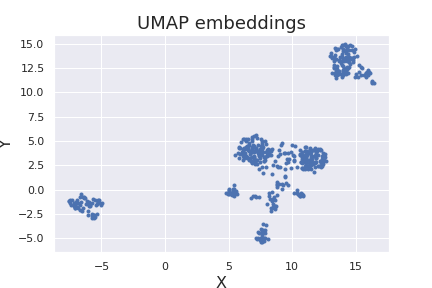


```python
p.nk_clust(method="agglomerative", linkage="ward", embeddings="umap", min_k=3, max_k=10, index="silhouette")#    silhouette
```

|   k |   silhouette |
|----:|-------------:|
|   3 |     0.729398 |
|   4 |     0.593319 |
|   5 |     0.651522 |
|   6 |     0.67073  |
|   7 |     0.690803 |
|   8 |     0.600566 |
|   9 |     0.571473 |
|  10 |     0.531138 |


```python
p.cluster(method="agglomerative", linkage="ward", embeddings="umap", n_clusters=3)
p.plot_clusters("scatter", outpath=os.path.join(FIGURES_DIR, "p_3clusters_scatter.png"))
```

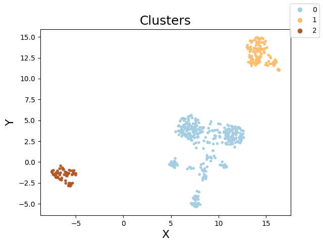


```python
p.plot_clusters("heatmap", outpath=os.path.join(FIGURES_DIR, "p_3clusters_heatmap.png"))
```

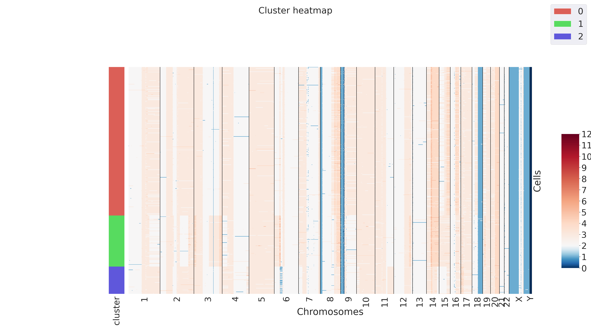


```python
p.cluster(method="agglomerative", linkage="ward", embeddings="umap", n_clusters=7)
p.plot_clusters("scatter", outpath=os.path.join(FIGURES_DIR, "p_7clusters_scatter.png"))
```

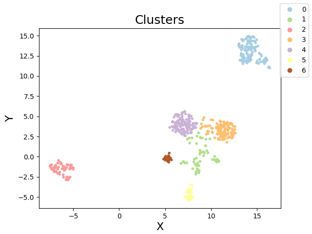


```python
p.plot_clusters("heatmap", outpath=os.path.join(FIGURES_DIR, "p_7clusters_heatmap.png"))
```


## Experiment 3: SHscore on daughter cell lines and their downsamplings


```python
ss1 = phylics.MultiSample.from_list(ex1, ex2)
s = ss1.SHscores(n_jobs=10)
```

|    | samples_partition   |    score |
|---:|:--------------------|---------:|
|  0 | [['ex2'], ['ex1']]  | 0.832106 |


```python
ss1.plot_dendrogram(outpath=os.path.join(FIGURES_DIR, "ex1_ex2_heatmap.png"))
```

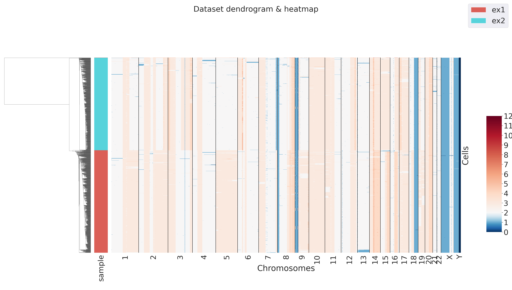


```python
df = pd.DataFrame(columns=["sh_score"])

FRACTION_DIRS1 = ["EX1_10", "EX1_20", "EX1_30", "EX1_40", "EX1_50", "EX1_60", "EX1_70", "EX1_80", "EX1_90"]
FRACTION_DIRS2 = ["EX2_10", "EX2_20", "EX2_30", "EX2_40", "EX2_50", "EX2_60", "EX2_70", "EX2_80", "EX2_90"]

# Compute SHscore between one of the EX1 dataset and all EX2 fractions 
for i, d in enumerate(FRACTION_DIRS2):
    f = os.path.join(DATA_DIR, "Downsampling", d, "SegCopy")
    s2 = phylics.Sample.from_file(f, sample_name=d)
    ss = phylics.MultiSample.from_list(ex1, s2)
    score = ss.SHscores(n_jobs=10)["score"].values[0]
    df = df.append({"sh_score":score}, ignore_index=True)
    
# Compute SHscore between one of the EX2 dataset and all EX1 fractions 
for i, d in enumerate(FRACTION_DIRS1):
    f = os.path.join(DATA_DIR, "Downsampling", d, "SegCopy")
    s2 = phylics.Sample.from_file(f, sample_name=d)
    ss = phylics.MultiSample.from_list(ex2, s2)
    score = ss.SHscores(n_jobs=10)["score"].values[0]
    df = df.append({"sh_score":score}, ignore_index=True)

import seaborn as sns
import matplotlib.pyplot as plt
sns.set(font_scale=1.5)
sns.set(style="darkgrid")
plt.gca().set_ylim([0.0,1.0])
sns.violinplot(data=df)
plt.savefig(os.path.join(FIGURES_DIR, "shscore_downsamplings.png"))
plt.close("all")
```

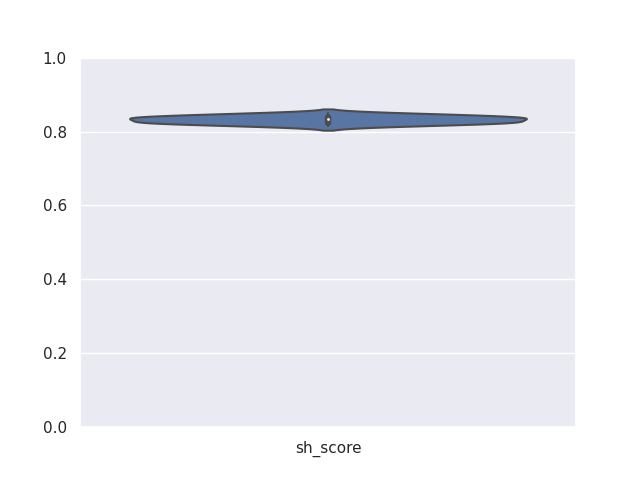
